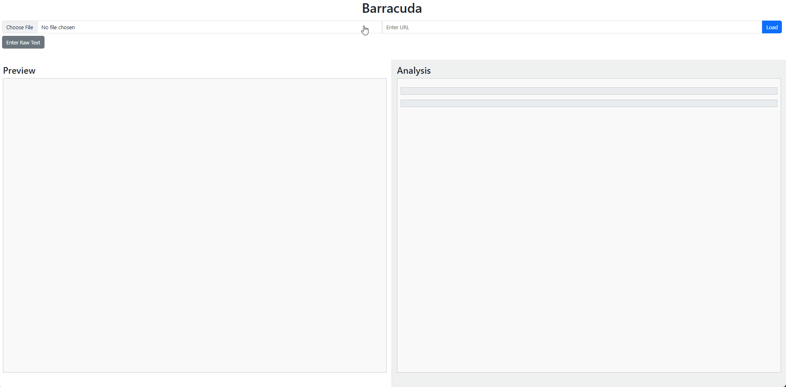

Barracuda v1.0
=========

Overview
--------

**Barracuda** is an intelligent web application that extracts and analyzes textual content from **PDFs**, **URLs**, or **raw text inputs** to automatically map relevant sentences to specific **MITRE ATT&CK T-Codes**. Using a hybrid of **semantic similarity (via sentence transformers)** and **keyword-based boosting (via TF-IDF)**, Barracuda enables detailed content-tagging, analysis, and cyber threat reporting in an intuitive and interactive interface.

It supports direct PDF uploads (with OCR fallback for scanned documents), URL scraping, and raw text entry, offering a multi-tabbed view for managing and comparing multiple analyses. Sentences are automatically associated with tactics and techniques based on semantic meaning and important keywords, giving users a clear way to explore, highlight, and filter through significant findings.

Barracuda is designed to assist cyber threat analysts, incident responders, and researchers by speeding up document triage and providing structured, transparent mappings from unstructured reports.

Features
--------

-   **Content Input**: Upload PDFs, provide URLs, or enter raw text for analysis.

-   **T-Code Analysis**: Automatically associates sentences with T-Codes, displaying counts and details.

-   **Sentence Management**: View sentences per T-Code, drop sentences from specific T-Codes, or remove them from all T-Codes.

-   **Preview Modes**: Toggle between PDF and text views for uploaded PDFs, with sentence highlighting.

-   **Tabbed Interface**: Analyze multiple documents simultaneously with a tabbed interface (up to 5 tabs).

-   **Navigation**: Click on sentences to navigate to their location in the preview and view associated T-Codes.

Prerequisites
-------------

-   **Python 3.8+**: Required to run the Flask server.

-   **Dependencies**: Listed in `requirements.txt`.

-   **Web Browser**: A modern browser (e.g., Chrome, Firefox) to access the web interface.

Installation
-------------

```
git clone https://github.com/williamjsmail/Barracuda
cd Barracuda
pip install -r requirements.txt
python .\app.py
```

After initial installation steps, additional files will be download for the 'all-mpnet-base-v2' pre-trained sentence transformer model. Once downloads are complete, training will occur. This normally take 5-10 minutes depending on CPU. If you have an NVIDIA GPU, Barracuda will identify this and training will be increased anywhere from 10x-50x. After additional training is completed, a python flask server will be started on 'http://localhost:5000'.

Usage
-------------

To use Barracuda, provide a Cyber Threat Intelligence report in PDF, a URL, or raw text. It will then create a tab for your analysis. Techniques identified will be shown in the right hand analysis panel. Click on a T-Code to view the sentences associated with it. You can then click on a sentence to show you where the sentence lives within the document, or view additional T-Codes the sentences is associated with. If you find a sentence to be irrelevant to the T-Code or irrelevant in general (i.e. advertisements on a webpage), simply click 'Drop' or 'Drop from All'. This will allow you to disassociate the sentence from either the one T-Code, or every T-Code. To drop and entire T-Code, simply click 'Drop' next to the 'Selected T-Code:' field.




License
-------

MIT License

Copyright (c) 2025 williamjsmail

Permission is hereby granted, free of charge, to any person obtaining a copy
of this software and associated documentation files (the "Software"), to deal
in the Software without restriction, including without limitation the rights
to use, copy, modify, merge, publish, distribute, sublicense, and/or sell
copies of the Software, and to permit persons to whom the Software is
furnished to do so, subject to the following conditions:

The above copyright notice and this permission notice shall be included in all
copies or substantial portions of the Software.

THE SOFTWARE IS PROVIDED "AS IS", WITHOUT WARRANTY OF ANY KIND, EXPRESS OR
IMPLIED, INCLUDING BUT NOT LIMITED TO THE WARRANTIES OF MERCHANTABILITY,
FITNESS FOR A PARTICULAR PURPOSE AND NONINFRINGEMENT. IN NO EVENT SHALL THE
AUTHORS OR COPYRIGHT HOLDERS BE LIABLE FOR ANY CLAIM, DAMAGES OR OTHER
LIABILITY, WHETHER IN AN ACTION OF CONTRACT, TORT OR OTHERWISE, ARISING FROM,
OUT OF OR IN CONNECTION WITH THE SOFTWARE OR THE USE OR OTHER DEALINGS IN THE
SOFTWARE.
